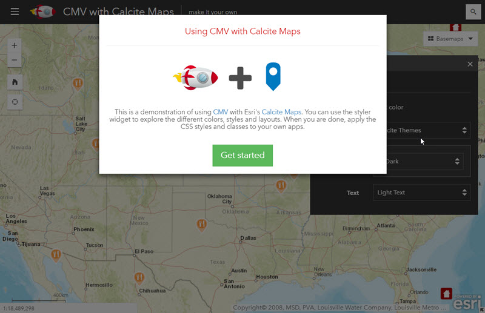
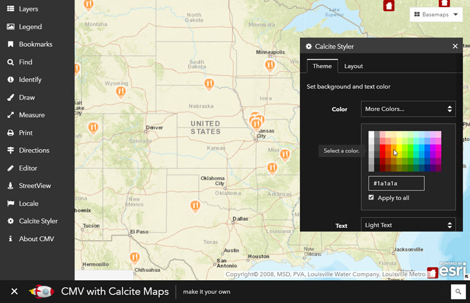
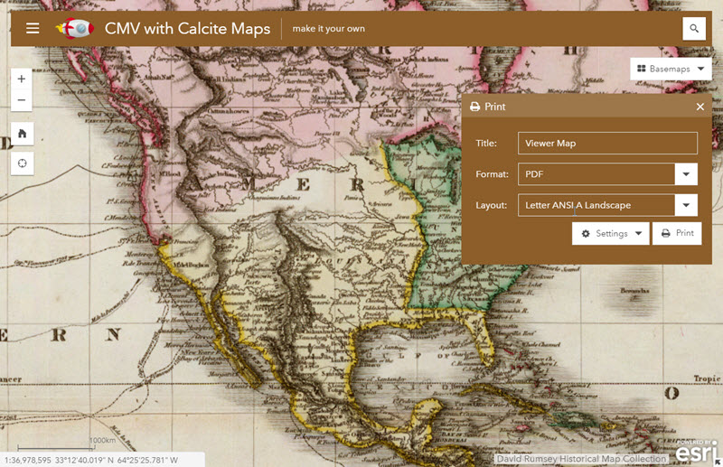
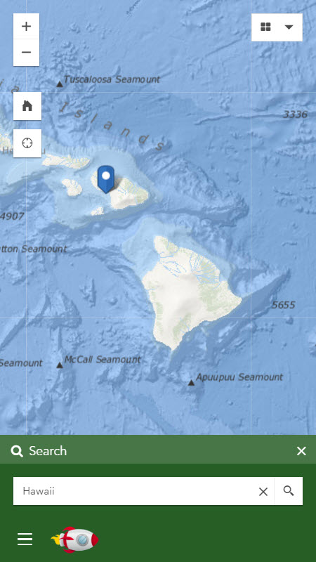
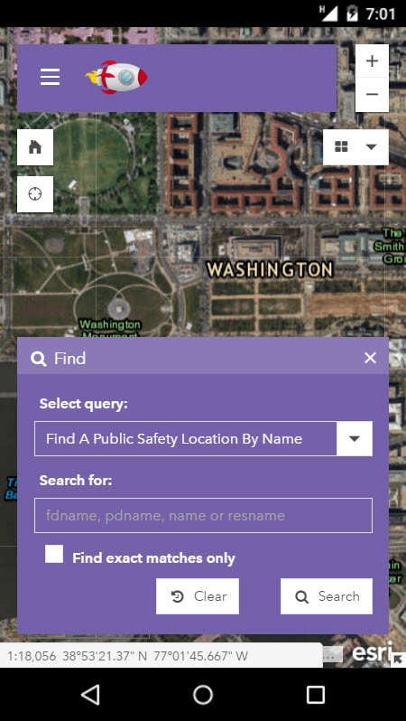

# cmv-calcite-maps

This repo combines [CMV](https://github.com/cmv/cmv-app) with Esri's [Calcite Maps](https://github.com/esri/calcite-maps/). Calcite Maps is "A theme for [Bootstrap](https://www.getbootstrap.com/) for designing, styling and creating modern map apps." The Esri repository provides documentation on the Calcite Maps CSS and JavaScript files.

## Implementation
There are very few changes needed to use Calcite Maps. The majority of the customizations are within the HTML page. See the [example](./demo.html). In addition, you will need to include the new [_CalciteMixin.js](./config/_CalciteMixin.js) in [app.js](./config/app.js). A CSS file [cmv-calcite.css](./css/cmv-calcite.css) is included which helps with the styling of your CMV application.

##[Demo](https://tmcgee.github.io/cmv-calcite-maps/demo.html)
The demo in this repo [includes](./config/viewer.js) many core CMV widgets as well as a custom [Styler widget](widgets/CalciteStyler.js) adapted from Calcite Maps. You can use this widget to experiment with the different theme styles and colors.

## Widgets
Most of the CMV core widgets work without modification. The notable exceptions are the Esri Editor and Directions widgets which have some styling issues. Custom The Directions widget will 

It is expected that many of the [contributed CMV widgets](https://github.com/cmv/cmv-contrib-widgets) and widgets for Esri's Web AppBuilder (Using the method documented in [this repo](https://github.com/tmcgee/cmv-wab-widgets)) should work without modification though few have been tested at this point. Widgets that use a full pane like the [Attributes Table widget](https://github.com/tmcgee/cmv-widgets#attributes-tables) are not currently supported though hopefully will be in the near future.

## Mobile
One of the strengths of using Calcite Maps is the responsive design provided by the Bootstrap framework.

## License

[MIT](LICENSE.md)
